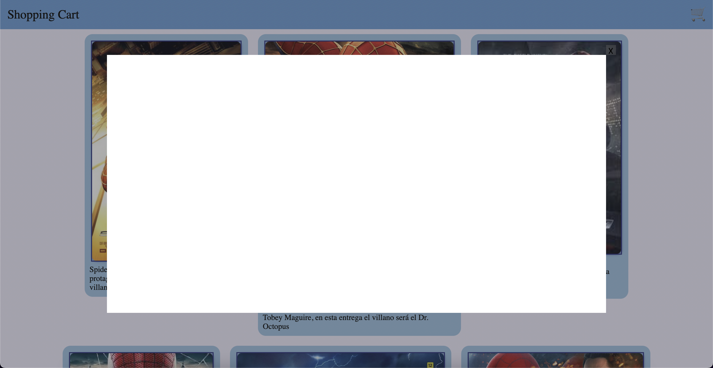

# Cart

**Carrito de compras utilizando unicamente html, css y javascript**

    - Lista las ultimas 8 peliculas de Spider-Man para tomarlas como producto 'a vender'

    - Por cada pelicula hay una tarjeta de producto que contiene imagen del poster de la pelicula y una descripción

    - Las tarjetas son redimensionables dependiendo del ancho de la pantalla

    - Las tarjetas van llenando el lugar disponible en una linea y al ya no caber más se pasan a la siguiente

    - En la barra de navegación de la página se encuentra el titulo del proyecto del lado izquierdo y un simbolo de carrito al lado derecho

    - Al hacer click sobre el simbolo de carrito se abre un modal

    - El modal del carrito tiene un botón para cerrar, por fuera del recuadro donde se listarán los productos agregados al carrito

    - También se puede cerrar el modal haciendo click en el fondo y presionando la tecla Escape

    - Botón de agregar al carrito en cada tarjeta

    - Carga la información para las tarjetas desde un archivo javascript externo simulando asi la base de datos

    - Almacena el carrito en localstorage para recuperarlo después 

    - Por cada item en el carrito poner botón de eliminar

**Funciones por añadir:**

    [X] Botón de eliminar del carrito si es que ya se encuentra en el

    [ ] Botones para editar la cantidad que se desea comprar, directo en la tarjeta del producto

    [ ] Barra de busqueda para filtrar las peliculas listadas

    [ ] Listar productos que están en el carrito en el modal

    [ ] En el modal poner botón de vaciar carrito

    [ ] Por cada item en el carrito poner botones para editar la cantidad deseada

    [ ] Calcular y mostrar el monto total en el modal del carrito

    [ ] Modal de producto, para al hacer click en una tarjeta poder ampliarla sin salirse de la página y poder ver más detalles

Las funciones listadas se irán tachando al empezar a trabajar en ellas y al finalizarlas se pasarán al listado de funciones listas, al principio

Avance actual [aqui](https://raymundosantorski.github.io/cart/).

Con el carrito cerrado
    
    
Con el carrito abierto
    
